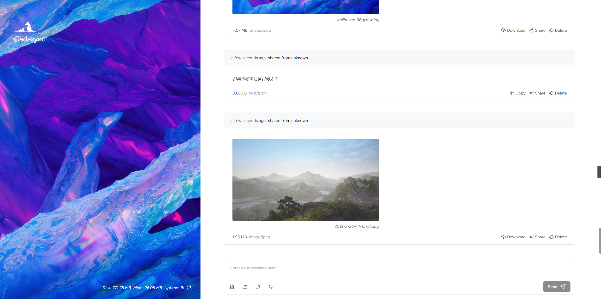

# Ephemera ✨ (积极开发中)

**Ephemera: 您的自托管、注重隐私的设备间文件分享中心。**

是否厌倦了仅仅为了在手机、笔记本和台式机之间快速分享文件、链接或笔记，就需要连接数据线、登录云服务或安装各种应用程序？Ephemera 运行在您自己的硬件上（如 NAS、树莓派、软路由等），提供无缝的、**基于浏览器的拖拽式体验**，用于临时存储和文件传输——无需担心供应商锁定或隐私泄露。

采用 **Rust 🦀 + React ⚛️ + WebAssembly 🕸️** 构建，追求高性能和现代 Web 能力。

[](https://github.com/tonitrnel/synclink/stargazers)
[](https://github.com/tonitrnel/synclink/issues)
[](LICENSE)
<!-- [ 如果有 CI，添加构建状态徽章 -->

<!-- 💡 **强烈推荐:** 在此处添加一个简短的 GIF 演示，展示拖放和关键功能！ -->
<!--  -->


<!-- 考虑添加 1-2 张截图，展示不同功能或响应式布局 -->

## ✨ 主要功能 & 技术亮点

Ephemera 利用现代 Web 技术，提供强大而高效的文件共享体验：

**🚀 高性能文件处理:**

*   **极速上传:** 直接将文件/文件夹拖拽到浏览器界面。
*   **客户端哈希计算 (Wasm):** 通过 **Rust 编译的 WebAssembly** 在**浏览器端**计算 SHA-256，高效检测重复文件，**避免不必要的上传流量**。（对于 >= 2MB 的文件使用 Web Worker）。
*   **分片上传 & 断点续传:** 大于 100MB 的文件会自动分片，并支持断点续传，确保在不稳定网络下的可靠性。
*   **浏览器文件夹打包 (Wasm):** 使用 **Rust 编译的 WebAssembly** 在**浏览器端**直接将文件夹打包成 `.tar` 压缩包，**实现整个文件夹的上传**。（推荐使用 Chrome/Chromium 以获得最佳兼容性）。
*   **高效流式传输:** 后端 (Rust/Axum) 和前端均利用流式 API（HTTP Range 请求、Tar 流读取）处理大文件和压缩包，内存占用低。

**💻 无缝跨设备体验:**

*   **即时文本/图片分享:** 直接将文本或图片粘贴到 Ephemera 界面。
*   **实时更新 (SSE):** 文件列表的变化通过 Server-Sent Events 即时同步到所有连接的客户端。
*   **基于 Web，无需安装:** 在本地网络（或通过反向代理远程访问）的任何设备上，通过现代浏览器即可访问。

**🔒 隐私与控制 (开发中):**

*   **完全自托管:** 您的数据存储在**您自己的硬件**上。
*   **简单的文件索引:** 使用人类可读的 TOML 文件存储索引（未来计划迁移到 SQLite 以支持多用户等更丰富的功能）。
*   **(TODO) 多用户支持:** 计划使用 SQLite 支持独立的公共和私人用户空间。
*   **(TODO) 客户端加密探索:** 正在研究使用 WebAssembly 实现**客户端加密**（SRP 登录、本地文件加/解密），以达到**零知识**存储。

**🌐 高级网络功能 (实验性):**

*   **点对点直接传输 (实验性):** 正在探索使用 WebRTC 和 WebSocket 实现设备间的直接文件传输（目前存在问题，正在积极开发/修复中）。
*   **(TODO) Wget/Curl 友好下载:** 计划支持便捷的命令行下载。

**⚠️ 重要提示:** 由于浏览器的安全特性（例如 Wasm 使用的 `SharedArrayBuffer`），Ephemera **必须在 HTTPS 环境下使用**。强烈建议使用 Nginx 等反向代理配置 SSL/TLS。

## 🐳 Docker 安装部署

1.  **准备目录和配置文件:**
    ```bash
    export CUSTOM_DIR=/path/to/your/ephemera/data # 替换为你想要的路径
    mkdir -p $CUSTOM_DIR/data
    mkdir -p $CUSTOM_DIR/config
    mkdir -p $CUSTOM_DIR/logs
    # 复制或创建配置文件，可以从示例开始:
    # cp config/ephemera.conf.example $CUSTOM_DIR/config/ephemera.toml
    touch $CUSTOM_DIR/config/ephemera.toml # 或手动创建
    # 根据需要编辑 $CUSTOM_DIR/config/ephemera.toml
    ```
    配置文件选项请参考 [`config/ephemera.conf.example`](./config/ephemera.conf.example)。

2.  **运行 Docker 容器:**
    ```bash
    docker run -d \
            --name ephemera \
            --restart always \
            -p 8080:8080 \ # 将容器端口映射到宿主机端口
            -v $CUSTOM_DIR/data:/app/storage \
            -v $CUSTOM_DIR/config/ephemera.toml:/app/config/ephemera.toml \
            -v $CUSTOM_DIR/logs:/app/logs \
            ghcr.io/tonitrnel/ephemera:latest # 或指定版本，如 0.4.0
    ```
    现在可以通过 `http://<你的宿主机IP>:8080` 访问 Ephemera（如果配置了反向代理，则通过代理地址访问）。

## 🔧 Nginx 反向代理配置示例 (推荐用于 HTTPS)

```nginx
map $http_upgrade $connection_upgrade {
    default upgrade;
    ''      "";
}

server {
    # 监听 80 端口并重定向到 HTTPS
    listen 80;
    server_name your.domain.com; # 替换为你的域名
    return 301 https://$host$request_uri;
}

server {
    listen 443 ssl http2;
    server_name your.domain.com; # 替换为你的域名

    # SSL 证书路径
    ssl_certificate /path/to/your/fullchain.pem; # 替换为你的证书路径
    ssl_certificate_key /path/to/your/privkey.pem; # 替换为你的私钥路径

    # 安全性增强 (推荐)
    ssl_protocols TLSv1.2 TLSv1.3;
    ssl_prefer_server_ciphers on;
    ssl_ciphers "EECDH+AESGCM:EDH+AESGCM:AES256+EECDH:AES256+EDH";
    # 如果需要，添加其他安全头，如 HSTS

    # 增大请求体大小以支持大文件上传
    client_max_body_size 1g; # 根据需要调整

    location / {
        proxy_http_version 1.1;
        proxy_set_header Upgrade $http_upgrade;
        proxy_set_header Connection $connection_upgrade;

        proxy_set_header Host $host;
        proxy_set_header X-Real-IP $remote_addr;
        proxy_set_header X-Forwarded-For $proxy_add_x_forwarded_for;
        proxy_set_header X-Forwarded-Proto $scheme;

        # 为长时间操作增加超时时间
        proxy_connect_timeout       300; # 5 分钟
        proxy_send_timeout          600; # 10 分钟
        proxy_read_timeout          600; # 10 分钟
        send_timeout                600; # 10 分钟

        # 将请求转发给 Ephemera 容器
        proxy_pass http://127.0.0.1:8080; # 假设 Ephemera 运行在 8080 端口

        # 可选：更好的错误处理
        proxy_intercept_errors on;
        # 如果需要，添加自定义错误页面
    }
}
```

## 💻 本地开发环境搭建

按照以下步骤在本地运行 Ephemera 以进行开发或测试。

**前提条件:**

*   [Rust](https://www.rust-lang.org/tools/install) (推荐最新稳定版)
*   [Node.js](https://nodejs.org/) (推荐 LTS 版本) 和 npm (或 pnpm/yarn)
*   [`wasm-pack`](https://rustwasm.github.io/wasm-pack/installer/)
*   (可选，但推荐用于图片预览) [libvips](https://www.libvips.org/install.html) 开发库 (Debian/Ubuntu 上为 `libvips-dev`)。

**步骤:**

1.  **克隆仓库:**
    ```bash
    git clone https://github.com/tonitrnel/ephemera.git
    cd ephemera
    ```

2.  **构建 WebAssembly 模块:**
    ```bash
    # 构建 SHA256 Wasm 模块 (输出到 web 项目目录)
    cd wasm/sha256
    wasm-pack build --target web --out-dir ../../web/src/wasm/sha256

    # 构建 Tar Wasm 模块 (输出到 web 项目目录)
    cd ../tar
    wasm-pack build --target web --out-dir ../../web/src/wasm/tar
    cd ../..
    # 返回项目根目录
    ```

3.  **配置并运行后端服务:**
    ```bash
    cd server
    # 如果配置文件不存在，复制示例配置
    # cp ../config/ephemera.conf.example ./config.toml
    # 如果需要，编辑 ./config.toml
    cargo build
    # 生产环境构建: cargo build --release
    cargo run
    # 服务启动 (默认: http://127.0.0.1:8080)
    # 让这个终端保持运行或在后台运行
    cd ..
    # 返回项目根目录
    ```

4.  **安装依赖并运行前端开发服务:**
    ```bash
    cd web
    npm install # 或 pnpm install / yarn install
    npm run dev
    # 前端开发服务启动 (默认: http://localhost:5173 或类似地址)
    ```

5.  **在浏览器中访问:** 打开前端开发服务提供的 URL (例如 `http://localhost:5173`)。

## 🛠️ 技术栈

*   **后端:** [Rust](https://www.rust-lang.org/), [Axum](https://github.com/tokio-rs/axum), [Tokio](https://tokio.rs/), [Serde](https://serde.rs/), [Toml](https://crates.io/crates/toml), [Libvips](https://github.com/libvips/libvips) (可选，用于图像处理)
*   **前端:** [React](https://react.dev/), [TypeScript](https://www.typescriptlang.org/), [Vite](https://vitejs.dev), [Shadcn UI](https://ui.shadcn.com/), [Tailwind CSS](https://tailwindcss.com/)
*   **WebAssembly (Wasm):** 使用 [`wasm-pack`](https://rustwasm.github.io/wasm-pack) 将 [Rust](https://www.rust-lang.org/) 编译为 Wasm，用于客户端哈希计算 (SHA-256) 和 TAR 打包。

## 🤝 贡献代码

欢迎贡献！请随时提交 Pull Request 或开启 Issue。

1.  Fork 本仓库
2.  创建您的特性分支：`git checkout -b feature/YourAmazingFeature`
3.  提交您的修改：`git commit -m 'feat: Add some AmazingFeature'`
4.  推送代码到分支：`git push origin feature/YourAmazingFeature`
5.  提交 Pull Request

我们欢迎以下类型的贡献：
*   修复 Bug
*   改进文档
*   添加新功能 (建议先开启 Issue 讨论)
*   提升性能或代码质量

## 📜 开源许可

本项目采用 MIT 许可证。详情请参阅 [LICENSE](LICENSE) 文件。